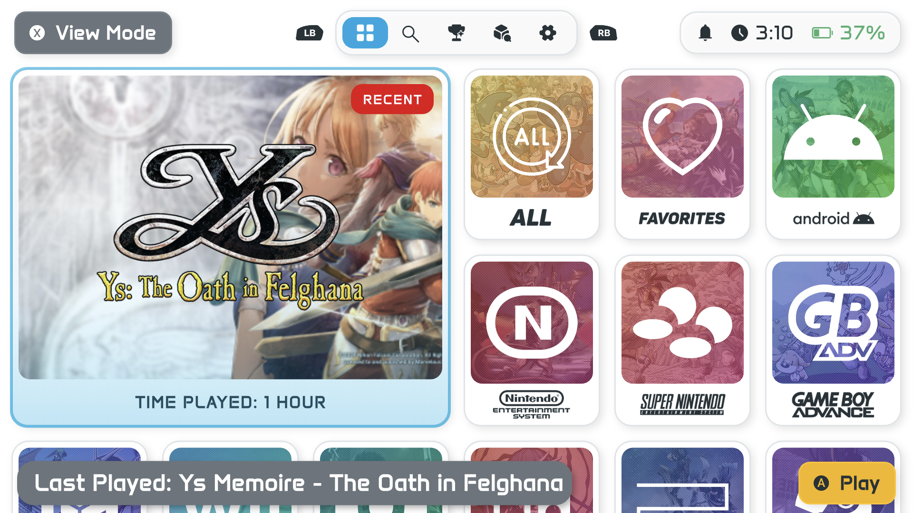
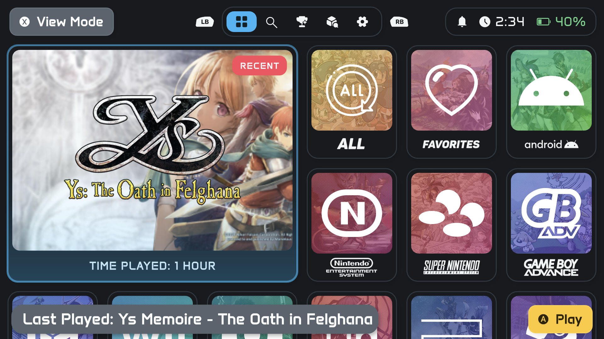
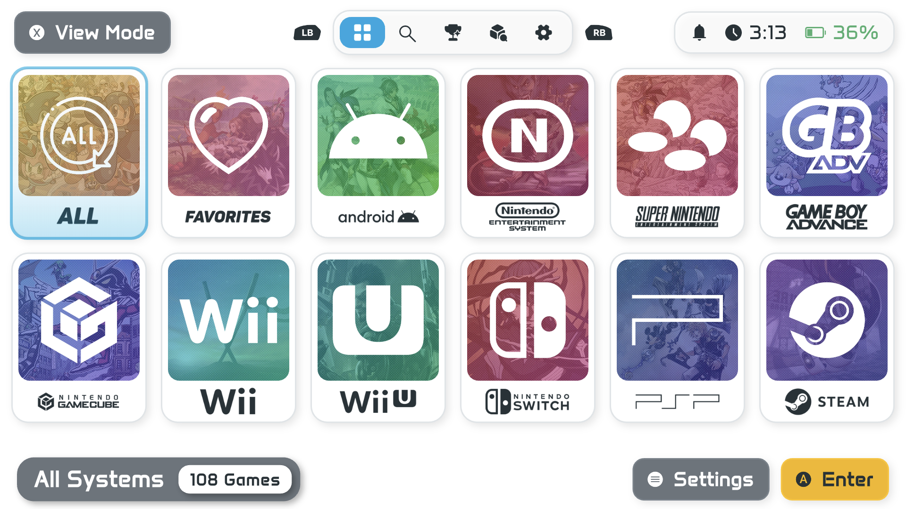
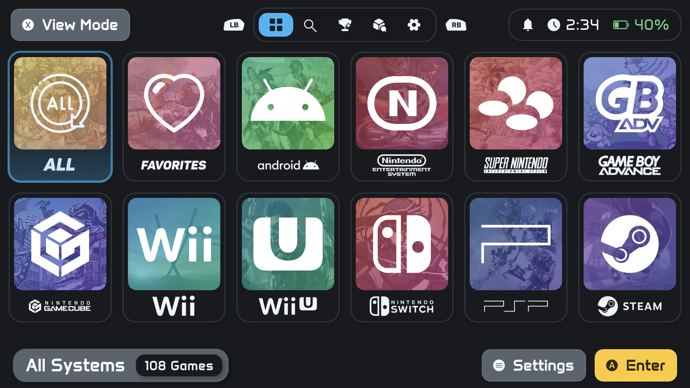
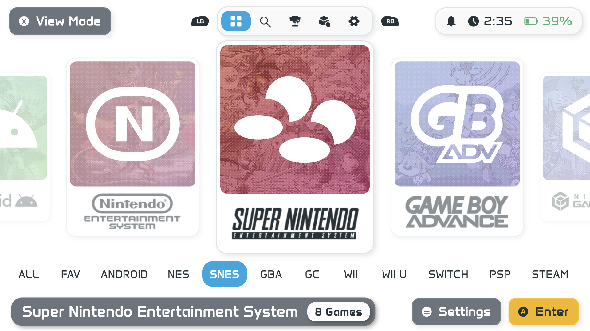
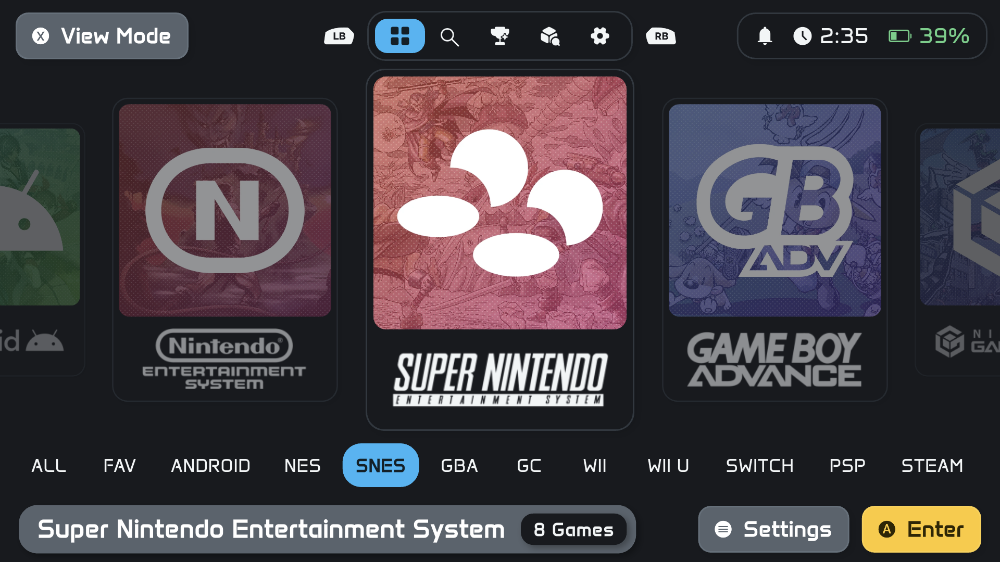
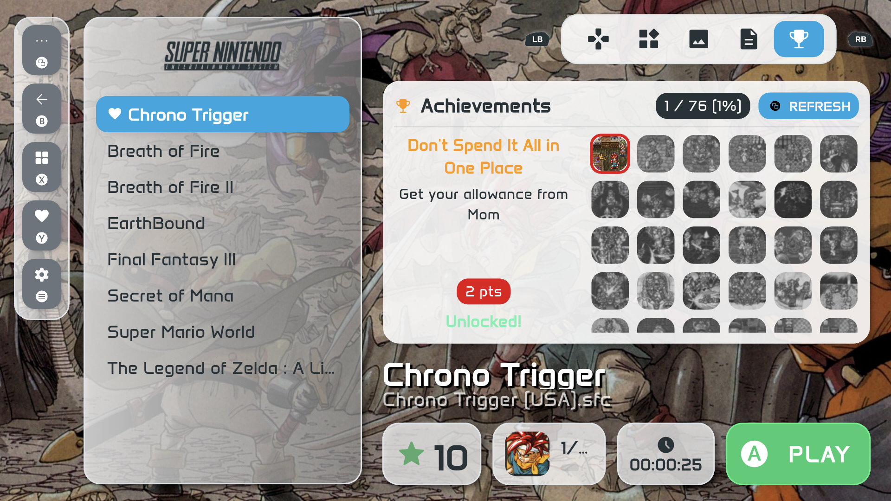
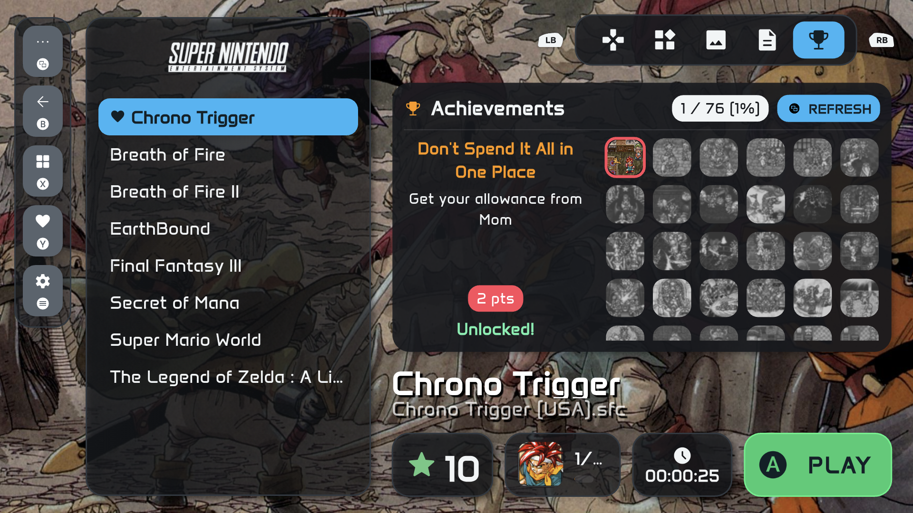

# RiiSU Theme for NeoStation



An iiSU-inspired theme for NeoStation. Complete with system art icons, light color theme, and dark color theme.

Thanks to [iiSU Interpreted for ES-DE](https://github.com/VictorUnlocked/iisu-interpreted-es-de) for providing the system art icons.

## Preview
| Light Theme | Dark Theme |
| :---:     | :---: |
|  |  |
|  |  |
|  |  |
|  |  |

## How to Use
1. Clone the repository
```
git clone https://github.com/mult1v4c/riisu.git
```
2. Connect to your device and navigate to the NeoStation `user-data` folder.

Default Android Location:
```
/device/Android/data/com.neogamelab.neostation/files/user-data/
```
3. Copy the `themes` and `custom_themes` folders into the `user-data` folder. Your folder structure should look like this:
```
user-data/
├─── custom_themes/
├─── media/
├─── systems/
└─── themes/
```
4. Open `themes/manifest.json` and add the RiiSU theme entry. See `sample_manifest.json` for the required format.
```
    {
      "name": "RiiSU",
      "author": "iiSU Network",
      "folder": "RiiSU",
      "preview": "RiiSU.png"
    }
```
5. Restart NeoStation to ensure changes are applied.
6. In NeoStation, navigate to `Settings > Themes` and select either `RiiSU Light` or `RiiSU Dark`.
7. To use the included system art icons change it in `Settings > System Art` and select `RiiSU`.

## Acknowledgement

Thanks to [iiSU Interpreted for ES-DE](https://github.com/VictorUnlocked/iisu-interpreted-es-de) for providing the system art icons.

Thanks to [iiSU Network](https://iisu.network/) for the main inspiration.

Thanks to [NeoStation](https://neostation.dev/) for being an amazing frontend.